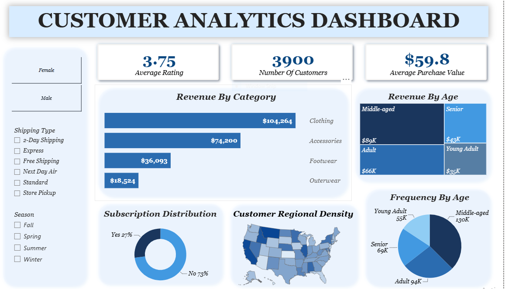

# Customer Shopping Behavior Analytics

End-to-end customer analytics project covering data cleaning, SQL-based business analysis, and an interactive Power BI dashboard — built to help a retail business understand customer segments, purchasing behavior, and revenue drivers.

**Tools used:** Python · SQL · Power BI

---

## 📌 Business Problem

How can a retail company leverage consumer shopping data to identify trends, improve customer engagement, and optimize marketing and product strategies?

Specifically, the business needed answers to:
- Which customer segments generate the most revenue?
- Which product categories perform best?
- How effective is the subscription program?
- Which geographic locations contribute the highest sales?
- How satisfied are customers with their shopping experience?

---

## 🗂️ Dataset

- **Source:** [Dataset source — add link here]
- **Size:** 3,900 customer records
- **Files:**
  - `data/customer_shopping_behavior.csv` — original raw dataset
  - `data/customer_shopping_cleaned.csv` — cleaned dataset after preprocessing

| Attribute | Description |
|---|---|
| Customer ID | Unique customer identifier |
| Age | Customer age |
| Gender | Male / Female |
| Category | Product category purchased |
| Purchase Amount | Total transaction value |
| Location | Customer state |
| Subscription Status | Membership status (Yes/No) |
| Review Rating | Customer satisfaction rating |
| Shipping Type | Delivery method selected |
| Season | Season in which purchase occurred |

---

## 🔧 Project Workflow

### 1. Data Preparation & Modeling — Python
📁 `python/customer_shopping_behaviour.ipynb`

- Handled missing/inconsistent values in **Review Rating**
- Engineered new features: **Age Group** and **Purchase Frequency**
- Cleaned and exported the dataset for downstream SQL and Power BI use

### 2. Data Analysis — SQL
📁 `sql/customer_shopping_analysis.sql`

Structured the cleaned data and ran business-focused queries to extract insights, including:
- Revenue by gender
- High-spending discount users
- Top 5 products by rating
- Shipping type comparison
- Subscribers vs. non-subscribers
- Discount-dependent products
- Customer segmentation
- Top 3 products per category
- Repeat buyers and subscription correlation
- Revenue by age group

### 3. Visualization & Insights — Power BI
📁 `powerbi/customer_segmentation.pbix`

Interactive dashboard featuring:
- KPI cards — Average Rating, Number of Customers, Average Purchase Value
- Revenue by Category (bar chart)
- Revenue & Purchase Frequency by Age Group
- Subscription Distribution (donut chart)
- Customer Regional Density (U.S. map)
- Filters — Gender, Shipping Type, Season



### 4. Report & Presentation
📁 `report/customer_analytics_report.pdf`

Full write-up of the business problem, methodology, key findings, and recommendations.

---

## 🔍 Key Findings

- **Female customers** generate slightly higher total revenue than male customers
- **Express shipping** customers spend **12% more** per transaction
- **Blouses and dresses** achieved the highest customer ratings (5/5)
- **Subscribers** consistently spend more and show stronger purchase loyalty
- **Half of all customers are first-time buyers** — a strong opportunity for retention-focused marketing
- **Clothing** generates the highest revenue, followed by **Accessories**
- **Middle-aged customers** are the most valuable segment by revenue and purchase frequency
- **Top revenue states:** Montana, Illinois, California, Idaho, Nevada

---

## 💡 Business Recommendations

| Area | Recommendation |
|---|---|
| **Product Strategy** | Expand and cross-sell within Clothing & Accessories |
| **Customer Targeting** | Prioritize personalized marketing for middle-aged customers |
| **Retention** | Build a New → Returning → Loyal customer conversion funnel |
| **Subscriptions** | Introduce loyalty rewards to boost subscription adoption |
| **Customer Experience** | Promote top-rated products; investigate lower-rated ones |
| **Regional Strategy** | Focus marketing spend on Montana, Illinois, California, Idaho & Nevada |

---

## 📁 Repository Structure

```
customer-shopping-analytics/
│
├── data/
│   ├── customer_shopping_behavior.csv
│   └── customer_shopping_cleaned.csv
│
├── python/
│   └── customer_shopping_behaviour.ipynb
│
├── sql/
│   └── customer_shopping_analysis.sql
│
├── powerbi/
│   └── customer_segmentation.pbix
│
├── report/
│   └── customer_analytics_report.pdf
│
├── assets/
│   └── dashboard_preview.png
│
└── README.md
```

---

## 👤 Author

**Sainaba Hanan**
Data Analyst | Python · SQL · Power BI · Tableau · Excel

- Portfolio: [sainaba-hanan.github.io](https://sainaba-hanan.github.io)
- LinkedIn: [linkedin.com/in/sainaba-hanan-accountant-dataanalyst](https://linkedin.com/in/sainaba-hanan-accountant-dataanalyst)
- Email: sainabahanan123@gmail.com
